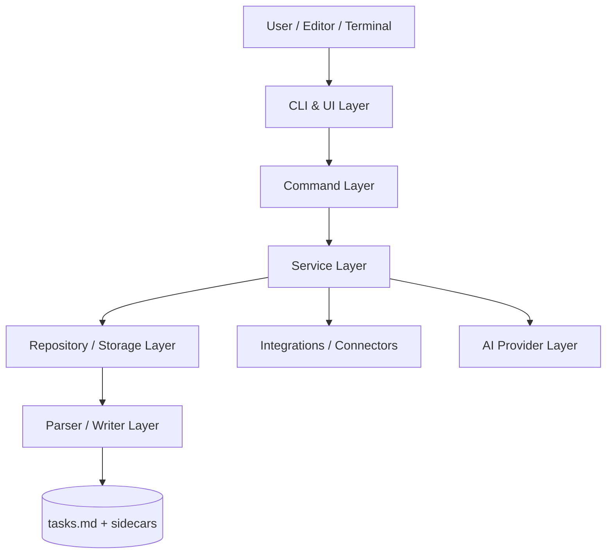
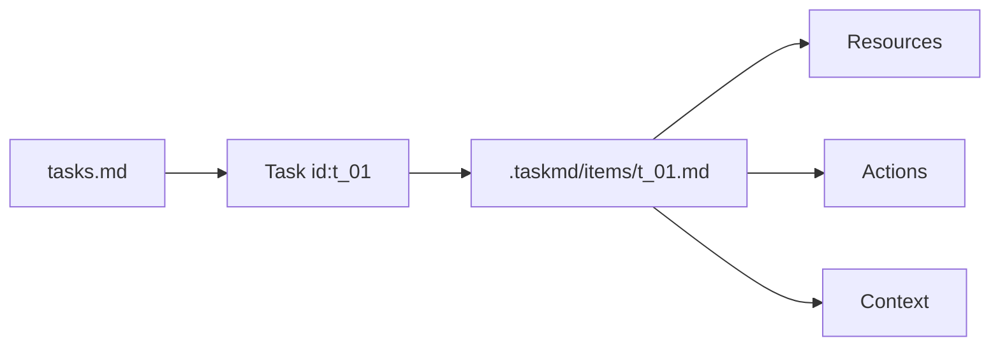
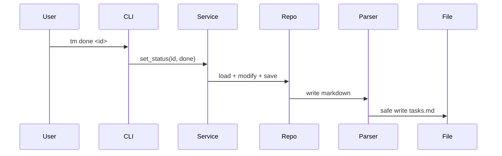
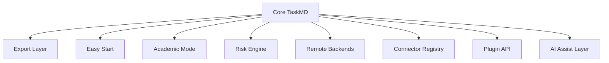

# 架构图（Architecture Diagrams）

## 1. 总体架构图（High-Level Architecture）

## 2. 主文件与 Sidecar 关系图（Primary File & Sidecar Relation）

## 3. 读写路径图（Read/Write Flow）

## 4. 极后期扩展图（Late-Stage Extensibility）

